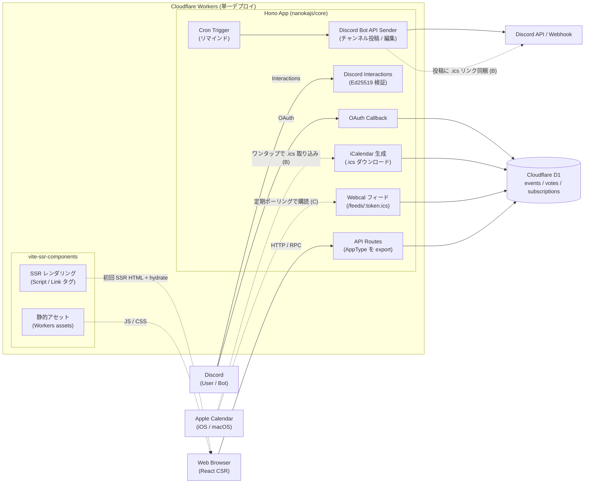

# Hiyori 要件定義

## 1. 概要

Discord と連携可能な日程調整 Web ツール。

複数人で候補日を出し合い、投票やリアクションで合意形成し、決定した日程を
**カレンダーへ自動登録** および **Discord へ自動通知** するところまでを一気通貫で行う。

「日程を決める」だけでなく「決めた後の反映」までカバーすることで、調整 → 反映の
分断による忘れ・齟齬を防ぐことを狙う。

---

## 2. 背景・目的

- 既存の日程調整ツール（調整さん、伝助、When2meet など）は **決定後の反映が手動**。
  - 決まった日時を Google カレンダーに手で入れ直す
  - Discord にコピペで告知する
- 上記の手間を省き、**Discord コミュニティ内で完結する** 軽量なツールを作る。
- 同時に、自作ライブラリ `@nanokajs/core` の実運用フィードバックを得る。

---

## 3. ユーザー像

| ロール | 説明 |
| --- | --- |
| オーガナイザー | 調整を立ち上げる人。候補日を提示し、最終決定権を持つ。Discord OAuth ログイン必須 |
| 参加者（Discord ユーザー） | Discord OAuth でログインして候補日に回答 |
| 参加者（ゲスト） | Discord ログインせず、**表示名のみ入力して**回答。完全匿名は不可 |
| Hiyori Bot | Discord サーバーに常駐し、Interactions Endpoint 経由で通知・スラッシュコマンド（将来）を受け付ける |

想定シチュエーション例:

- Discord 上のゲーム仲間で次回の集まる日を決める
- 趣味サークルのオフ会日程を決める
- 小規模チームの MTG 日程を社外メンバーも含めて決める

---

## 4. ユースケース

### UC-1: 調整イベントの作成
1. オーガナイザーが Web UI で新規イベントを作成
2. タイトル / 説明 / **既定所要時間（例: 60 分 / 90 分 / 120 分）** / 候補枠（複数、各枠は **開始時刻** が必須、終了時刻は省略時に既定所要時間から自動補完） / 投票締切 を設定
3. 公開用 URL と Discord 連携先（チャンネル）を取得

### UC-2: Discord からのイベント作成（任意機能）
1. Discord で `/hiyori new` のようなスラッシュコマンド実行
2. Bot がモーダルや返信で候補日を受け取り、Web 側にイベント登録
3. チャンネルに調整 URL を投稿

### UC-3: 参加者の回答
1. 参加者が公開 URL にアクセス
2. Discord OAuth でログイン **または** ゲストとして表示名を入力（匿名不可、必ず何らかの名前を伴う）
3. 各候補枠に対して `○ / △ / ×` を回答
4. ゲストには参加者編集トークンを Cookie / localStorage で発行し、同じブラウザから自分の回答を編集できる
5. リアルタイムに集計結果が更新される

### UC-4: 日程確定
1. オーガナイザーが集計結果を見て確定日を選択
2. 「確定」ボタンで以下が自動実行される
   - Discord 指定チャンネルへ確定通知（埋め込みメッセージ）
   - 連携済みカレンダー（Google Calendar）にイベント作成
   - 参加者（連携済みユーザー）のカレンダーにも招待を送る（任意）

### UC-5: リマインド
- 確定日の N 時間前に Discord へリマインド通知
- Cloudflare Cron Triggers で実行

---

## 5. 機能要件

### 5.1 必須機能
- F-01 イベント CRUD（タイトル、説明、**既定所要時間（分）**、候補枠（開始時刻必須、終了時刻は省略可・省略時は既定所要時間で補完、終日候補は不可）、締切、ステータス）
- F-02 候補日に対する投票（○ / △ / ×、コメント任意）
- F-03 集計表示（参加者 × 候補日のマトリクス、合計スコア）
- F-04 オーガナイザーによる確定操作
- F-05 確定時に **Hiyori Bot** が指定チャンネルに通知（埋め込みメッセージで日時・参加者、`.ics` 追加ボタンを含む）
- F-06 認証方式は二系統:
  - **Discord OAuth2 ログイン**（オーガナイザーは必須、参加者は任意）
  - **ゲスト投票**（Discord ログイン無し、ただし表示名入力必須。完全匿名は不可）
- F-07 **【簡易連携 / B 方式】** 確定時に iCalendar (`.ics`) を生成し、Discord 通知メッセージに添付/リンクで配布。Apple Calendar / Google Calendar / Outlook いずれも 1 タップで追加可
- F-08 **【本格連携 / C 方式】** ユーザー別の **Webcal 購読 URL** を発行し、Workers から ICS フィードを配信。Apple Calendar に一度購読すれば、以降の確定イベントが自動反映される

### 5.2 推奨機能
- F-09 Discord スラッシュコマンド (`/hiyori`) 対応
- F-10 確定日の N 時間前リマインド（Cron Triggers）
- F-11 候補日のタイムゾーン対応

### 5.3 将来的に検討
- 公開 URL のアクセス制限（パスフレーズ / Discord ロール）
- 繰り返しイベント
- アンケート型（候補日以外の投票項目）
- Slack / LINE 連携
- Google Calendar / Outlook の OAuth による双方向同期（読み取り・編集）
- iCloud CalDAV による直接書き込み（Apple ID + アプリ用パスワード方式）
- マルチテナント機能（**現状はセルフホスト推奨で対応しない**）

---

## 6. 非機能要件

| 区分 | 要件 |
| --- | --- |
| 性能 | 想定 10〜200 人規模/イベント、p95 < 300ms（CF Workers エッジ前提） |
| 可用性 | Cloudflare の SLA に準拠。シングルリージョン D1 で開始 |
| セキュリティ | OAuth トークンは KV / D1 暗号化保存。Webhook URL は Secrets で管理 |
| プライバシー | 回答者の Discord ID は最小限のみ保持。退会時はカスケード削除 |
| 監査性 | 確定操作 / 通知送信は監査ログに残す |
| データ保持 | デフォルトは永久保持。`EVENT_RETENTION_DAYS`（正の整数、未設定なら無効）を設定すると、完了済み（`closed` / `cancelled`）イベントを最終活動（確定 / 取消、無ければ作成）から N 日経過後に Cron Trigger（毎日 3:00 UTC）で物理削除する。votes / participants / candidates / decisions も同時に削除し、削除操作は AuditLog（`event.retention.deleted`）に記録する（F-12 #24） |
| コスト | 個人運用想定。CF Workers 無料枠内での運用を目標 |

---

## 7. 技術スタック

| レイヤ | 採用技術 |
| --- | --- |
| ランタイム | Cloudflare Workers |
| Web フレームワーク | `@nanokajs/core` (Hono + Drizzle + Zod の薄いラッパー) |
| DB | Cloudflare D1 (SQLite) |
| スキーマ / バリデーション | nanoka の Model DSL（Zod 派生） |
| 認証 | Discord OAuth2（ログインユーザー）/ ゲストトークン Cookie（ゲスト投票者） |
| 外部 API | Discord Bot API（Interactions Endpoint, REST API） |
| カレンダー連携 | iCalendar (RFC 5545) 生成 + Webcal フィード配信（Apple Calendar 等の標準クライアントに購読させる） |
| 定期実行 | Cloudflare Cron Triggers |
| フロントエンド | **React 19 + Vite 7 + `vite-ssr-components`（SSR/CSR ハイブリッド）** |
| 型共有 | **Hono RPC（バックエンド / クライアントで型をエンドツーエンド共有）** |
| データ取得 (CSR) | TanStack Query v5（Suspense / Optimistic Updates 前提） |
| スタイリング | Tailwind CSS |
| ビルド | Vite SSR モード、`vite build --outDir=dist/client` ＋ Workers `assets` で同一 Worker から配信 |
| 言語 | TypeScript 5.9+（`strict: true`、モノレポ時は Project References）|
| デプロイ | Wrangler + GitHub Actions |

`@nanokajs/core` を採用する理由:
- D1 を前提とした薄いラッパーで Workers と相性が良い
- Model DSL から D1 スキーマ・Zod バリデータ・TS 型を一括導出できる
- `.serverOnly()` / `.writeOnly()` でトークンなどの境界制御が宣言的にできる

フロントエンド方針（2026年現在のベストプラクティス採用）:
- **公式推奨の [`vite-ssr-components`](https://github.com/honojs/vite-plugins) を採用**（旧 `hono-vite-react-stack` は deprecated）
- 初回表示は Hono で SSR、インタラクティブな集計マトリクスや投票 UI は React の CSR にハイドレート
- API 呼び出しは Hono RPC でクライアントが型推論を受ける（`AppType` を 1 変数から推論し、ルートは必ずメソッドチェーン）
- 単一 Worker でフロント・バック・静的アセットを配信し、デプロイをシンプルに保つ
- HonoX は依然 alpha のため当面採用しない

---

## 8. システム構成（概要）

- クライアントは Hono RPC クライアント (`hc<AppType>(...)`) で API を叩く
- `AppType` はバックエンドの Hono アプリから型のみエクスポートし、Project References で共有する
- フロント・バック・静的アセットを 1 つの Worker から配信し、デプロイ単位を 1 つに保つ

---

## 9. データモデル（初期案）

nanoka の Model DSL で定義する想定。

- **User**: id, discordUserId (unique), username, globalName (optional), avatar (optional), createdAt, updatedAt — Discord OAuth ログイン済みユーザーのプロフィールキャッシュ
- **Session**: id, userId (FK→User), tokenHash (serverOnly, SHA-256), createdAt, lastUsedAt, expiresAt — 30日 TTL のセッション。tokenHash のみ保存、生トークンは保存しない
- **Event**: id, organizerDiscordId, title, description, **defaultDurationMinutes (int, 必須)**, status (`open` / `closed` / `cancelled`), deadline, timezone, discordChannelId, createdAt
- **Candidate**: id, eventId, startAt (UTC, 時刻必須), endAt (UTC, 時刻必須。書き込み時に `startAt + Event.defaultDurationMinutes` で補完、オーガナイザーが明示的に上書きした場合はその値を保存)
- **Participant**: id, eventId, kind (`discord` / `guest`), discordUserId (nullable, kind=discord 時のみ), displayName (必須、ゲストでも名前なしの匿名は不可), guestToken (serverOnly, nullable, kind=guest 時のみ)
- **Vote**: id, candidateId, participantId, choice (`yes` / `maybe` / `no`), comment（**投票は必ず Participant に紐付き、匿名 Vote は許可しない**）
- **Decision**: id, eventId, candidateId, decidedAt, icsUid (RFC 5545 の UID), discordMessageId
- **CalendarSubscription**: id, ownerDiscordId, tokenHash (serverOnly, SHA-256), scope (`user-all` / `server:{guildId}`), createdAt, lastAccessedAt — 生 token（高エントロピー 64 hex）は発行 / 再生成レスポンスで 1 回だけ返し、DB には SHA-256 hash のみ保存する（Session と同一パターン、#25）
- **AuditLog**: id, actorDiscordId, action, payload, createdAt

- `Decision.icsUid` は ICS の `UID` フィールドに使い、同一イベントの再配布で重複登録を防ぐ
- `CalendarSubscription` の生 token は URL に埋め込まれるため、URL を知る者が全予定を読める前提でローテーション可能にする。照合はリクエスト URL の token を SHA-256 化して `tokenHash` と比較する
- トークン類は `.serverOnly()` を付与し、API 出力に絶対に漏らさない

---

## 10. 外部連携

### 10.1 Discord
- **専用 Bot を作成**し、対象 Discord サーバーに招待する運用
  - Bot 権限: `Send Messages` / `Embed Links` / `Manage Messages`（自身のメッセージ編集用）
  - Incoming Webhook 単体運用は採用しない（双方向のアクション / 後からの編集 / スラッシュコマンド対応のため）
- **OAuth2**（ユーザー識別用）— スコープは `identify` 中心、`email` / `guilds` は必要時のみ
- **Interactions Endpoint** を Workers の特定パスに設定し、Ed25519 署名検証を必ず行う
- **REST API** で確定通知メッセージを投稿（埋め込み + `.ics` リンクボタン）
- Bot トークンは `wrangler secret put DISCORD_BOT_TOKEN` で管理

### 10.2 カレンダー連携（Apple Calendar 中心）

Apple は Calendar 用の OAuth API を公開していないため、**標準フォーマット（iCalendar / Webcal）経由で連携する**。Apple Calendar に加えて Google Calendar / Outlook 等の主要クライアントもそのまま動く副次効果あり。

#### 10.2.1 B 方式 — `.ics` ファイル配布（MVP）
- 確定時に [RFC 5545](https://datatracker.ietf.org/doc/html/rfc5545) の VCALENDAR を生成
- Discord 通知の埋め込みに **「カレンダーに追加」リンク**を同梱（`https://{worker}/events/{id}.ics`）
- 参加者がリンクをタップ → OS が Apple Calendar（または既定のカレンダーアプリ）を開いて追加確認
- `UID` を `Decision.icsUid` と一致させ、再ダウンロードでも重複しない
- 更新・キャンセル時は `SEQUENCE` を増分、`STATUS:CANCELLED` で配信
- **時刻付き VEVENT**（`DTSTART` / `DTEND` を `YYYYMMDDTHHMMSSZ` 形式の UTC で出力）。`VALUE=DATE` を付けた終日イベントは出力しない。`Candidate.startAt` / `Candidate.endAt` をそのまま採用する

#### 10.2.2 C 方式 — Webcal 購読フィード（MVP、本格連携）
- ユーザーごとに購読 URL を発行: `webcal://{worker}/feeds/{token}.ics`
- スコープは「自分が参加するすべての確定イベント」を初期値とする
- Apple Calendar が定期ポーリング（標準は数時間間隔、ユーザー設定可）
- ICS フィードは複数 VEVENT を含む単一 VCALENDAR
- レスポンスに `Cache-Control` と `ETag` を設定し、Workers のサブリクエスト数を抑える
- トークンの再発行（リーク対策）と購読解除エンドポイントを提供

#### 10.2.3 将来検討
- iCloud CalDAV 直接書き込み（Apple ID + アプリ用パスワード方式）— 真の自動登録が可能だが UX が重い
- Google Calendar / Outlook の OAuth 連携（編集権限が欲しいケース）

---

## 11. 開発・運用

- 配布形態: **OSS / セルフホスト推奨**。1 インスタンス = 1 Discord サーバーを基本とし、運用したい人は自分の Cloudflare アカウントにデプロイする
- リポジトリ: 単一リポジトリ。`src/server`（Hono / RPC）と `src/client`（React entry）をディレクトリで分離
- パッケージマネージャ: `pnpm`（nanoka 例に準拠）
- ローカル開発: `vite` の SSR dev server（`@hono/vite-dev-server` 経由）+ `wrangler dev` を併用、D1 は `wrangler d1 execute --local`
- マイグレーション: `nanoka generate` で D1 マイグレーションを生成
- ビルド: `vite build`（クライアント）→ `vite build --ssr`（サーバー）→ `wrangler deploy`。アセットは Workers `assets` で同一 Worker から配信
- 型共有: バックエンドの `AppType` を `export type` し、フロント側で `hc<AppType>(...)` から RPC クライアントを生成。`tsconfig` は `strict: true`
- シークレット: `wrangler secret put` で Discord/Google のクライアントシークレット等を管理
- データ保持 (F-12 #24): セルフホスト運用者は `wrangler.jsonc` の `vars.EVENT_RETENTION_DAYS` に正の整数（日数）を設定すると、完了済みイベントの TTL 自動削除が有効になる。未設定（デフォルト）・0 以下・非数値は無効（永久保持）。cron は `triggers.crons` の `0 3 * * *`（毎時の cron は CLI 認証の期限切れ掃除用）
- テスト: Vitest（ユニット）、React Testing Library（コンポーネント）、Playwright（E2E の主要フロー）
- CI: GitHub Actions で typecheck / test / `wrangler deploy`

---

## 12. 未確定事項 / 要相談

1. ~~**フロントエンド方針**~~ — **決定: Hono + `vite-ssr-components` + React 19 + Vite 7 で SSR/CSR ハイブリッド、API 型共有は Hono RPC**
2. ~~**認証必須範囲**~~ — **決定: オーガナイザーは Discord OAuth 必須。参加者は Discord OAuth とゲスト投票（表示名入力）の両方を許可。完全匿名投票は不可**
3. ~~**カレンダー連携対象**~~ — **決定: Apple Calendar を主軸に iCalendar / Webcal の標準フォーマットで連携。Google / Outlook も同フォーマットで動くので副次的に対応**
4. ~~**Discord 通知方式**~~ — **決定: 専用 Bot を立てて Interactions Endpoint + REST API で通知。Webhook 単体運用は不採用**
5. ~~**マルチサーバー対応**~~ — **決定: マルチテナント機能は持たない。1 インスタンス = 1 Discord サーバーを基本とし、複数サーバーで使いたい人はセルフホストで対応**
6. ~~**デザイン**~~ — **決定: 専用 UI Kit (Hiyori デザインシステム) を独自に構築。Tailwind v4 + CSS variables で実装済み (#12)**
7. ~~**データ保持期間**~~ — **決定: MVP は永久保持 + ユーザー手動削除 (DELETE /api/events/:id) のみ。Cron Trigger による TTL ベースの自動削除は将来 (§5.3) で検討。セルフホスト運用者が環境変数で TTL を設定可能にする実装は別 Issue で対応**
8. **公開 URL のアクセス制限** — MVP では設けない（公開 URL を知る人は誰でも閲覧・投票可）。需要が出てきたら §5.3 で再検討

---

## 13. 最小スコープ（MVP）

最初のリリースで満たすべき範囲:

- イベント作成 / 投票 / 確定（F-01〜F-04）
- 確定時の Discord Webhook 通知（F-05）
- Discord OAuth ログイン（F-06）
- `.ics` 配布（F-07、B 方式）
- Webcal 購読フィード（F-08、C 方式）

`.ics` 生成と Webcal フィードは同じ ICS シリアライザを共有するため、両方を MVP に入れても追加コストは小さい。
スラッシュコマンドやリマインドは MVP 後に追加。
